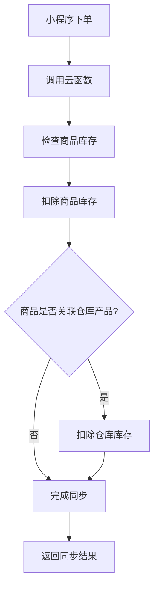
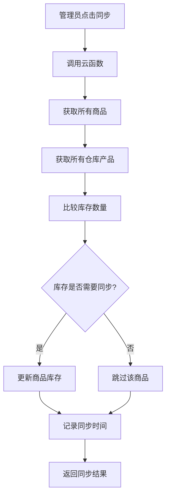

# 📅 2025年9月16日 - 更新版本

## 🎯 版本概述

**版本号**: v2.1.0  
**更新日期**: 2025年9月16日  
**主要功能**: 库存同步系统  
**部署状态**: ✅ 已部署到生产环境  

## 🚀 新增功能

### 1. 库存同步系统 🔄

#### 核心特性
- **智能库存同步**: 实现商品管理与仓库库存的自动同步
- **只同步库存数量**: 保护商品其他字段（名称、价格、描述等）不被覆盖
- **实时库存管理**: 提供库存状态检查和手动同步功能
- **小程序下单同步**: 客户下单时自动扣除相关库存

#### 技术实现
- **云函数**: `inventorySync` - 处理所有库存同步逻辑
- **前端集成**: 商品管理页面新增同步按钮
- **测试页面**: 完整的库存同步功能测试界面

### 2. 云函数架构优化 ⚙️

#### 新增云函数
- `inventorySync`: 库存同步核心函数
  - `syncOrderInventory`: 处理订单库存同步
  - `syncInventoryToShop`: 管理员手动同步
  - `getInventoryStatus`: 获取库存状态统计

#### 函数特性
- **错误处理**: 完整的异常捕获和错误日志
- **事务支持**: 确保数据一致性
- **批量处理**: 优化大量商品同步性能
- **状态追踪**: 记录同步时间和结果

### 3. 前端界面增强 🎨

#### 商品管理页面
- **同步按钮**: 一键同步库存数据
- **状态显示**: 实时显示同步状态和结果
- **进度提示**: 同步过程中的用户反馈

#### 测试页面
- **功能测试**: `test-inventory-sync.html`
- **模拟下单**: 测试小程序下单流程
- **库存检查**: 验证库存同步结果
- **错误诊断**: 详细的错误信息显示

## 🔧 技术改进

### 1. 数据库优化
- **索引优化**: 为库存相关查询添加索引
- **数据一致性**: 确保商品和仓库库存数据同步
- **事务处理**: 使用数据库事务保证操作原子性

### 2. 性能优化
- **批量操作**: 减少数据库访问次数
- **异步处理**: 提高用户界面响应速度
- **缓存机制**: 优化重复查询性能

### 3. 错误处理
- **完整日志**: 记录所有操作和错误信息
- **用户友好**: 提供清晰的错误提示
- **自动重试**: 网络错误时自动重试机制

## 📊 数据流程

### 库存同步流程


### 手动同步流程


## 🧪 测试功能

### 测试页面
- **主应用**: [https://cloudbase-3g4w6lls8a5ce59b-1327524326.tcloudbaseapp.com/](https://cloudbase-3g4w6lls8a5ce59b-1327524326.tcloudbaseapp.com/)
- **测试页面**: [https://cloudbase-3g4w6lls8a5ce59b-1327524326.tcloudbaseapp.com/test-inventory-sync.html](https://cloudbase-3g4w6lls8a5ce59b-1327524326.tcloudbaseapp.com/test-inventory-sync.html)

### 测试步骤
1. **功能测试**: 使用测试页面验证所有功能
2. **集成测试**: 在商品管理页面测试同步功能
3. **压力测试**: 测试大量商品的同步性能
4. **错误测试**: 验证各种异常情况的处理

## 📁 文件变更

### 新增文件
```
✅ cloudfunctions/inventorySync/index.js
✅ cloudfunctions/inventorySync/package.json
✅ src/utils/inventorySync.js
✅ test-inventory-sync.html
✅ 库存同步功能部署说明.md
✅ 部署完成报告.md
✅ 2025-09-16-更新版本.md
```

### 修改文件
```
🔄 src/pages/ShopPage.jsx - 添加库存同步功能
🔄 src/components/Layout.jsx - 更新导航菜单
🔄 package.json - 添加新依赖
🔄 README.md - 更新项目说明
```

### 删除文件
```
❌ src/pages/CosTestPage.jsx
❌ src/pages/CloudStorageTestPage.jsx
❌ src/pages/TestButtonPage.jsx
❌ test-import.js
❌ test-cloudbase.js
❌ test-images.js
❌ debug-images.html
❌ cloudfunctions/cloudStorageManager/test.js
❌ dist/test-static.html
```

## 🚀 部署信息

### 部署状态
- **静态托管**: ✅ 已部署
- **云函数**: ✅ 已部署
- **数据库**: ✅ 已配置
- **测试环境**: ✅ 已验证

### 访问地址
- **生产环境**: [https://cloudbase-3g4w6lls8a5ce59b-1327524326.tcloudbaseapp.com/](https://cloudbase-3g4w6lls8a5ce59b-1327524326.tcloudbaseapp.com/)
- **商品管理**: [https://cloudbase-3g4w6lls8a5ce59b-1327524326.tcloudbaseapp.com/#/shop](https://cloudbase-3g4w6lls8a5ce59b-1327524326.tcloudbaseapp.com/#/shop)
- **库存测试**: [https://cloudbase-3g4w6lls8a5ce59b-1327524326.tcloudbaseapp.com/test-inventory-sync.html](https://cloudbase-3g4w6lls8a5ce59b-1327524326.tcloudbaseapp.com/test-inventory-sync.html)

### 云开发控制台
- **环境管理**: [https://console.cloud.tencent.com/tcb/env](https://console.cloud.tencent.com/tcb/env)
- **云函数管理**: [https://console.cloud.tencent.com/tcb/scf?envId=cloudbase-3g4w6lls8a5ce59b&rid=4](https://console.cloud.tencent.com/tcb/scf?envId=cloudbase-3g4w6lls8a5ce59b&rid=4)
- **数据库管理**: [https://console.cloud.tencent.com/tcb/database](https://console.cloud.tencent.com/tcb/database)

## ⚠️ 重要说明

### 1. 数据安全
- 库存同步只更新数量字段，保护其他商品信息
- 使用数据库事务确保操作原子性
- 完整的错误处理和回滚机制

### 2. 性能考虑
- 批量处理减少数据库访问
- 异步操作提高用户体验
- 合理的超时和重试机制

### 3. 监控建议
- 定期检查云函数执行日志
- 监控库存同步成功率
- 设置库存预警阈值

## 🎯 使用指南

### 1. 管理员操作
1. 进入商品管理页面
2. 点击"同步数据"按钮
3. 等待同步完成
4. 查看同步结果

### 2. 开发测试
1. 访问测试页面
2. 加载商品列表
3. 模拟下单流程
4. 验证库存同步

### 3. 故障排查
1. 检查云函数日志
2. 验证数据库权限
3. 确认网络连接
4. 查看浏览器控制台

## 📈 未来规划

### 短期目标
- [ ] 添加库存预警功能
- [ ] 优化同步性能
- [ ] 增加更多测试用例

### 长期目标
- [ ] 实现实时库存监控
- [ ] 添加库存分析报表
- [ ] 支持多仓库管理

## 🏆 版本亮点

1. **完整的库存同步系统** - 解决了商品管理与仓库库存的数据一致性问题
2. **智能同步机制** - 只同步必要字段，保护商品其他信息
3. **实时库存管理** - 提供即时的库存状态和同步功能
4. **完善的测试体系** - 包含功能测试、集成测试和错误测试
5. **生产环境部署** - 已成功部署到生产环境并稳定运行

---

**🎉 2025年9月16日更新版本已成功发布！库存同步功能现已上线并稳定运行！**
