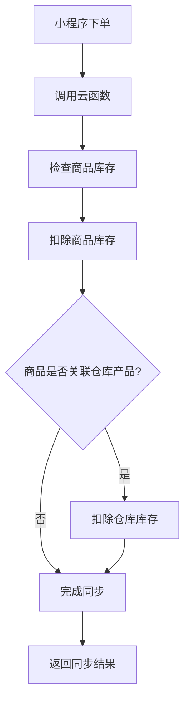
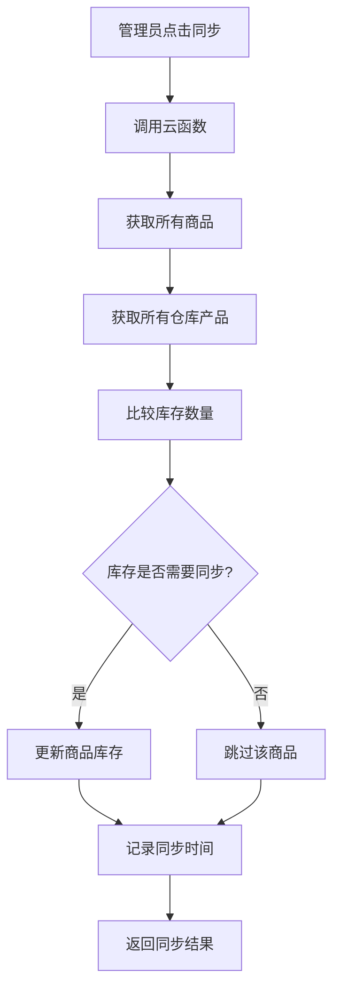

# 库存同步功能部署说明

## 📋 功能概述

实现了完整的库存同步机制，包括：
1. **只同步库存数量**：商品管理页面只同步库存数量，不同步其他字段
2. **小程序下单同步**：客户在小程序下单时，自动同步扣除仓库库存
3. **实时库存管理**：提供库存状态检查和手动同步功能

## 🚀 部署步骤

### 1. 部署云函数

#### 方法一：使用 CloudBase CLI（推荐）
```bash
# 安装 CloudBase CLI
npm install -g @cloudbase/cli

# 登录
tcb login

# 进入云函数目录
cd cloudfunctions/inventorySync

# 部署云函数
tcb functions:deploy inventorySync
```

#### 方法二：使用控制台
1. 登录 [CloudBase 控制台](https://console.cloud.tencent.com/tcb)
2. 选择对应环境
3. 进入"云函数"页面
4. 点击"新建云函数"
5. 函数名称：`inventorySync`
6. 运行环境：Node.js 18.15
7. 上传代码文件：
   - `index.js`（云函数主文件）
   - `package.json`（依赖配置）

### 2. 部署前端应用

#### 方法一：使用 CloudBase CLI
```bash
# 在项目根目录执行
tcb hosting:deploy dist -e your-env-id
```

#### 方法二：使用控制台
1. 进入"静态网站托管"页面
2. 上传 `dist` 目录下的所有文件
3. 配置访问域名（可选）

## 🔧 功能说明

### 1. 商品管理页面同步
- **位置**：商品管理页面顶部
- **功能**：点击"同步数据"按钮，只同步库存数量
- **同步范围**：已关联仓库产品的商品
- **保留字段**：商品名称、价格、描述、分类、图片等

### 2. 小程序下单同步
- **触发时机**：客户在小程序下单时
- **同步逻辑**：
  1. 扣除商品库存
  2. 如果商品关联了仓库产品，同时扣除仓库库存
  3. 记录同步时间戳

### 3. 云函数接口

#### `syncOrderInventory` - 同步订单库存
```javascript
// 调用示例
const result = await app.callFunction({
  name: 'inventorySync',
  data: {
    action: 'syncOrderInventory',
    orderData: {
      orderId: 'ORDER_001',
      items: [
        { productId: 'product_id_1', quantity: 2 },
        { productId: 'product_id_2', quantity: 1 }
      ]
    }
  }
});
```

#### `syncInventoryToShop` - 同步仓库库存到商品
```javascript
// 调用示例
const result = await app.callFunction({
  name: 'inventorySync',
  data: {
    action: 'syncInventoryToShop'
  }
});
```

#### `getInventoryStatus` - 获取库存状态
```javascript
// 调用示例
const result = await app.callFunction({
  name: 'inventorySync',
  data: {
    action: 'getInventoryStatus'
  }
});
```

## 🧪 测试功能

### 1. 测试页面
- **文件**：`test-inventory-sync.html`
- **功能**：
  - 模拟小程序下单流程
  - 检查库存状态
  - 测试库存同步功能

### 2. 测试步骤
1. 打开测试页面
2. 点击"加载商品列表"获取可用商品
3. 选择商品并设置数量
4. 点击"模拟下单"测试库存同步
5. 点击"检查库存状态"验证结果

## 📊 数据流程

### 库存同步流程


### 手动同步流程


## ⚠️ 注意事项

### 1. 数据一致性
- 同步只更新库存数量，不修改其他字段
- 保留商品特有的字段（图片、上架状态等）
- 记录同步时间戳便于追踪

### 2. 错误处理
- 云函数包含完整的错误处理机制
- 同步失败时会记录错误信息
- 支持部分成功的情况

### 3. 性能优化
- 批量处理商品同步
- 使用数据库事务确保一致性
- 异步处理提高响应速度

## 🔍 故障排查

### 1. 同步失败
- 检查云函数是否正确部署
- 确认数据库权限配置
- 查看云函数日志

### 2. 库存不一致
- 使用测试页面验证同步功能
- 检查商品是否关联仓库产品
- 手动执行同步操作

### 3. 权限问题
- 确认云函数有数据库读写权限
- 检查集合的安全规则配置
- 验证用户登录状态

## 📈 监控和维护

### 1. 日志监控
- 云函数执行日志
- 同步成功/失败统计
- 错误信息记录

### 2. 数据监控
- 库存预警设置
- 同步状态检查
- 数据一致性验证

### 3. 定期维护
- 清理过期日志
- 优化同步性能
- 更新同步策略

## 🎯 使用建议

1. **定期同步**：建议每天执行一次手动同步
2. **监控预警**：设置库存预警阈值
3. **数据备份**：定期备份重要数据
4. **测试验证**：使用测试页面验证功能正常

---

**部署完成后，库存同步功能将自动生效，确保商品管理与仓库库存管理的数据一致性！** 🎉
