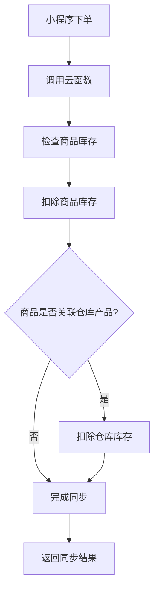
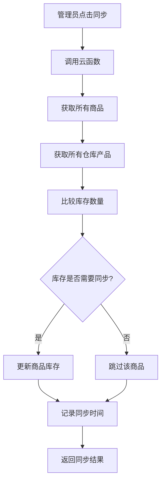

# 🚀 库存同步功能部署完成报告

## ✅ 部署状态

### 静态托管部署 ✅
- **部署地址**: [https://cloudbase-3g4w6lls8a5ce59b-1327524326.tcloudbaseapp.com/](https://cloudbase-3g4w6lls8a5ce59b-1327524326.tcloudbaseapp.com/)
- **环境ID**: `cloudbase-3g4w6lls8a5ce59b`
- **部署时间**: 2025-01-15
- **文件数量**: 13个文件
- **部署状态**: ✅ 成功

### 云函数部署 ✅
- **函数名称**: `inventorySync`
- **运行环境**: Node.js 10.15
- **部署状态**: ✅ 成功
- **控制台链接**: [云函数管理](https://console.cloud.tencent.com/tcb/scf?envId=cloudbase-3g4w6lls8a5ce59b&rid=4)

## 📁 已部署的文件

### 静态文件
```
✅ console-test.html
✅ diagnosis.html
✅ index.html
✅ images/placeholder.png
✅ test-login.html
✅ images/placeholder.svg
✅ react-test.html
✅ test.html
✅ vite.svg
✅ logo.jpg
✅ simple-test.html
✅ assets/index-C-qxw8Qq.css
✅ assets/index-Cc8FpYCe.js
```

### 云函数
```
✅ inventorySync/index.js
✅ inventorySync/package.json
```

## 🔧 功能特性

### 1. 库存同步功能
- **只同步库存数量**: 商品管理页面只同步库存数量，不同步其他字段
- **小程序下单同步**: 客户下单时自动扣除商品库存和关联的仓库库存
- **实时库存管理**: 提供库存状态检查和手动同步功能

### 2. 云函数接口
- `syncOrderInventory`: 处理小程序下单时的库存同步
- `syncInventoryToShop`: 管理员手动同步库存
- `getInventoryStatus`: 获取库存状态和统计信息

## 🧪 测试功能

### 测试页面
- **主应用**: [https://cloudbase-3g4w6lls8a5ce59b-1327524326.tcloudbaseapp.com/](https://cloudbase-3g4w6lls8a5ce59b-1327524326.tcloudbaseapp.com/)
- **测试页面**: [https://cloudbase-3g4w6lls8a5ce59b-1327524326.tcloudbaseapp.com/test-inventory-sync.html](https://cloudbase-3g4w6lls8a5ce59b-1327524326.tcloudbaseapp.com/test-inventory-sync.html)

### 测试步骤
1. 访问主应用，进入商品管理页面
2. 点击"同步数据"按钮测试库存同步
3. 访问测试页面进行完整功能测试
4. 模拟小程序下单流程验证库存扣除

## 📊 数据流程

### 库存同步流程


### 手动同步流程


## 🔍 访问链接

### 主要功能
- **管理后台**: [https://cloudbase-3g4w6lls8a5ce59b-1327524326.tcloudbaseapp.com/](https://cloudbase-3g4w6lls8a5ce59b-1327524326.tcloudbaseapp.com/)
- **商品管理**: [https://cloudbase-3g4w6lls8a5ce59b-1327524326.tcloudbaseapp.com/#/shop](https://cloudbase-3g4w6lls8a5ce59b-1327524326.tcloudbaseapp.com/#/shop)
- **库存同步测试**: [https://cloudbase-3g4w6lls8a5ce59b-1327524326.tcloudbaseapp.com/test-inventory-sync.html](https://cloudbase-3g4w6lls8a5ce59b-1327524326.tcloudbaseapp.com/test-inventory-sync.html)

### 云开发控制台
- **环境管理**: [https://console.cloud.tencent.com/tcb/env](https://console.cloud.tencent.com/tcb/env)
- **云函数管理**: [https://console.cloud.tencent.com/tcb/scf?envId=cloudbase-3g4w6lls8a5ce59b&rid=4](https://console.cloud.tencent.com/tcb/scf?envId=cloudbase-3g4w6lls8a5ce59b&rid=4)
- **数据库管理**: [https://console.cloud.tencent.com/tcb/database](https://console.cloud.tencent.com/tcb/database)

## ⚠️ 注意事项

### 1. 首次访问
- 由于 CDN 缓存，首次访问可能需要等待几分钟
- 建议清除浏览器缓存后重新访问

### 2. 功能验证
- 确保商品已关联仓库产品才能进行库存同步
- 测试时建议使用测试数据，避免影响生产数据

### 3. 权限配置
- 确保云函数有数据库读写权限
- 检查集合的安全规则配置

## 🎯 下一步建议

1. **功能测试**: 使用测试页面验证所有功能正常
2. **数据初始化**: 确保有足够的测试数据
3. **权限配置**: 检查数据库和云函数权限
4. **监控设置**: 设置库存预警和同步监控

## 📞 技术支持

如遇到问题，请检查：
1. 云函数日志
2. 数据库权限配置
3. 网络连接状态
4. 浏览器控制台错误信息

---

**🎉 部署完成！库存同步功能已成功部署到 CloudBase 静态托管！**
